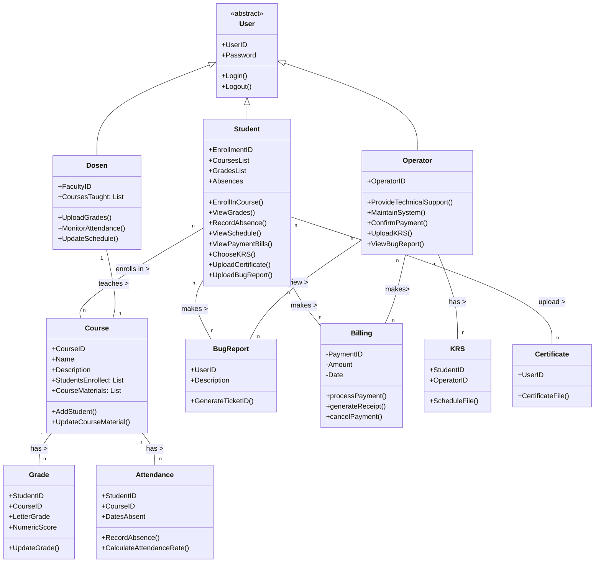

# HW_PBO (Varlent_422023028)
# Functionality
* *Capability*: The system should support different user roles (students, professors, admin, operator, parents) with role-specific functionalities. For students, this might include viewing grades and course materials. Professors would need to post grades and course materials, admins oversee system operations, operators handle technical issues, and parents access student progress.

* *Reusability*: Components like user authentication, data retrieval, and notification services should be designed for reuse across different modules.

* *Security*: User authentication, data encryption, and access control are essential. Sensitive data like student records and grades must be securely managed.

*Usability*
* *Human Factors*: The interface should be intuitive for all user types, accommodating varied tech proficiency. It should have a responsive design for different devices.

* *Consistency*: The system should maintain a consistent look and feel across all modules and user roles.

# Reliability
* *Documentation*: Comprehensive user guides for each user role, FAQs, and system manuals are necessary.
Reliability

* *Availability*: The system should be available 24/7, with minimal downtime.
Failure Rate & Duration: It should have a low failure rate. Any system failures should be resolved quickly.

* *Predictability*: System behavior in response to user actions should be predictable and consistent.

# Performance
Speed: Fast response times for user queries and actions.
Efficiency: Optimized for minimal resource consumption without compromising functionality.
Resource Consumption: Should be optimized to work smoothly on standard institutional hardware.
Scalability: Capable of handling an increasing number of users and data volume.

*Supportability*
Testability: The system should be easily testable to find and fix bugs.
Extensibility: It should be designed to allow easy updates and additions of new features.
Serviceability: Problems within the system should be easy to diagnose and fix.
Configurability: Allow easy configuration of features like user roles, permissions, and system settings.

# Use Case and User Stories
Use Case diagram will represent the interactions between various user roles and the system

*User Roles (Actor)*
* Student (mahasiswa)
* Professor(Dosen)
* Operator(Tata Usaha)

*User Stories (Functionalities)*
*student*
 * enroll course
 * view grade
 * access course material
 * view schedule
 * upload certificate
 * register krs
 * view attendance
 * view payment bill
 * submit bug report

 *Professor*
 * upload course
 * add grade
 * submit attendance
 * update schedule

*Operator*
* maintain system
* upload krs
* confirm payment
* view bug report

# Class Diagram
* Main Classes: User, Course, Grade, Material, Notification, SystemSettings.

* User Class: Subclasses for Student, Professor, Operator.

* Relationships:
  * Users to Courses (enrollment, teaching).
  * Users to Grades (viewing, uploading).
  * Users to Materials (access, management).

* Attributes: Specific to each class, like user ID, course details, grade records.

* Methods: Functions like registerCourse(), uploadGrades(), generateReport().

